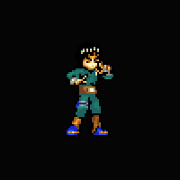

  

 

  <table border="0" width="95%">
    <tr>
      <td width="30%" align="center" valign="center">
        
          
        <i>"O trabalho duro vence o dom natural."</i>
      </td>
      <td width="70%" valign="center">
        
         
        

          👋 <b>Olá, eu sou Giovane!</b> Desenvolvedor focado em <b>soluções reais</b>. Transformo café e código em aplicações móveis fluidas e interfaces web de alta performance.
        

        

          ✝️ <b>Perfil:</b> Cristão (AD Missão Caçapava), movido pela ética e vontade de aprender. Não importa se é madrugada ou fim de semana: se o desafio é bom, eu estou dentro.
        

                

          
          
          
        

      </td>
    </tr>
  </table>

 

  
  
  <table width="90%" style="border: none;">
    <tr>
      <td align="center">
        <h3 style="margin-top: 10px;">🇬🇧 INTERCÂMBIO EM LONDRES (2022)</h3>
        

          Eleito <b>Melhor Aluno da ETEC</b> entre milhares de estudantes.  
          Ganhei uma bolsa integral para estudar na Inglaterra. Essa experiência provou minha dedicação, capacidade de adaptação e inglês prático.
        

      </td>
    </tr>
  </table>

 

  
    
  
  
  
  
   
  
  
  
  
   
  
  
  
  

 

  
    
  
  
  
  
  

 

  

