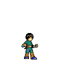

  

  
  <h3 style="display: inline;">"O trabalho duro vence o dom natural." – Rock Lee</h3>

---

  
  ## 👋 Sobre Mim | About Me
  
  > 🚀 **Desenvolvedor Mobile & Front-end** focado em criar experiências digitais fluidas e pixel-perfect.
  
  Sou apaixonado por transformar ideias em aplicações reais. Com um forte background técnico, migrei meu foco para a **experiência do usuário** através do **Flutter** no mobile e **React/Next.js/Angular** na web. Busco projetos desafiadores onde possa aplicar arquitetura limpa e UI moderna.

  
  
  

---

## 🛠️ Tech Stack | Arsenal

### 📱 **Mobile & Core**

  
  
  
  

### 💻 **Front-end Moderno**

  
  
  
  
  
  
  

### 🗄️ **Backend & Ferramentas (Background)**

  
  
  
  
  
  

---

## 📊 GitHub Analytics

  

 

  

---

  
  ### 🎓 Formação Acadêmica
  
  | Curso | Instituição | Período |
  | :--- | :---: | :---: |
  | **Sistemas para Internet** | UniCesumar | *2022 – 2025* |
  | **Téc. Desenv. Sistemas** | ETEC Machado de Assis | *2021 – 2022* |

   
  
  
  

